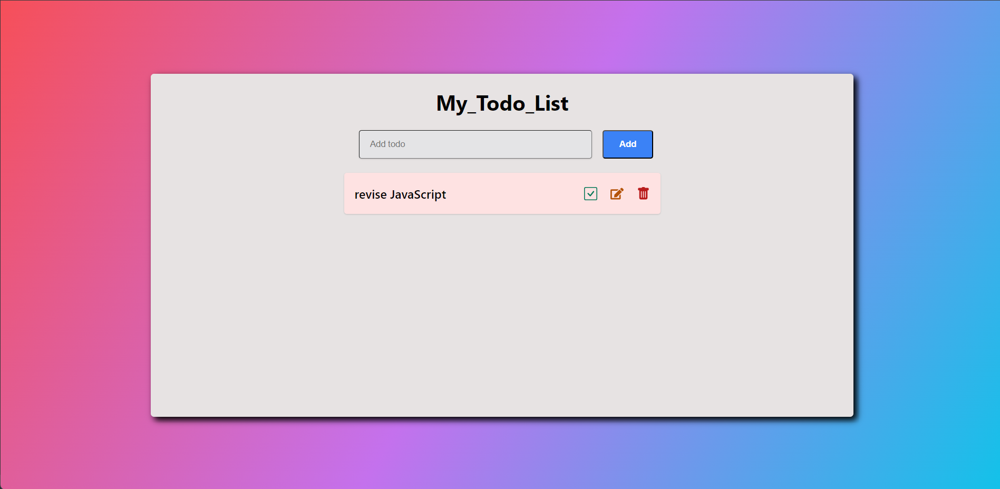

# [TODO APP](https://todo-app-azure-two.vercel.app)

## 📌 Introduction

[](https://awesome.re)
this todo app is built with React, React-Redux, and Redux Toolkit, enables users to add, delete, and edit tasks seamlessly. The combination of these technologies ensures a smooth user experience and efficient state management.

## 🚀 View Live Demo


<pre><center><a href="https://todo-app-azure-two.vercel.app"><b>todo-app-azure-two.vercel.app</b></a></center></pre>

## 👨‍💻 Tech Stack Used

-   React
-   redux/tookit
-   React-Redux
-   Hooks
-   JavaScript

## 🛠️ Installation Steps

Star and Fork the Repo 🌟 and this will keep us motivated.

1. Clone the repository

```bash
git clone https://github.com/adityaK87/todo_app.git
```

2. Change the working directory

```bash
cd todo_app
```

3. Install dependencies

```bash
npm install
```

4. Run the app

```bash
npm run start
```

## 📸 Screenshots


